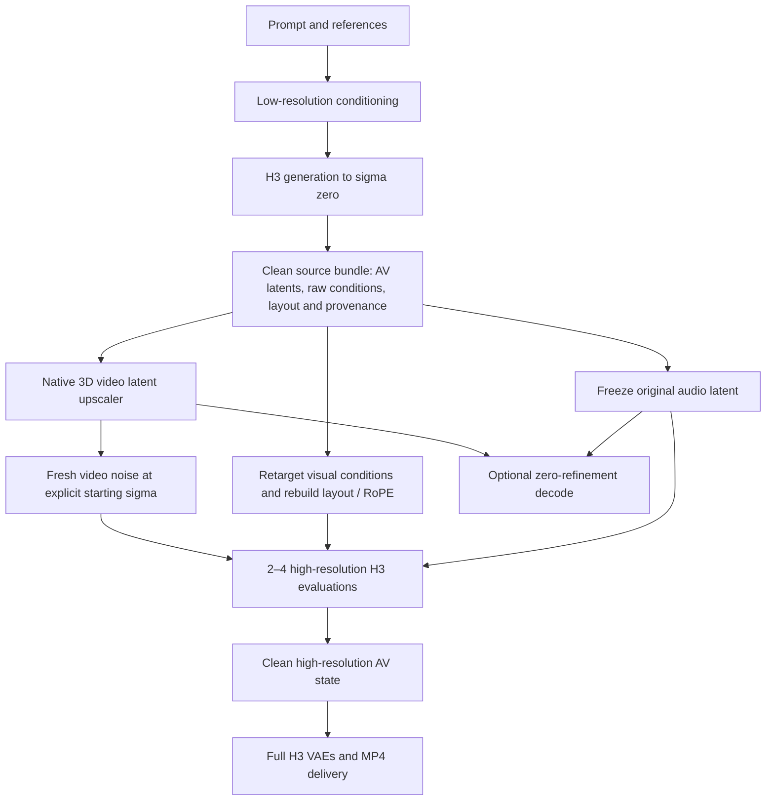

# Native latent upscaling from saved generation state

Status: **regular CUDA/Metal feature; implementation and comparison complete; visual qualification accepted**.
Originally written 2026-09-27 against h3cli `13c2000`. Work is tracked in the
[task list](../experiments/latent-upscale-tasks.md), with executed checks in the
[qualification record](../experiments/latent-upscale-qualification.md).

## 1. Outcome and scope

Generate a complete low-resolution segment once, save its clean AV latents and
conditioning, then run a separate native job that doubles spatial resolution,
optionally refines video with 2–4 H3 evaluations, and decodes the result. Preserve
the original audio latent exactly. The job must work after the first process
exits and without the original reference files. It must not decode the generated
video to pixels and re-encode it to obtain the larger latent.

The first release uses the published LBH 3D upscaler and dense BF16 H3 refinement.
Native CUDA and Metal paths are implemented and qualified; CUDA is the
performance comparison platform. Bounded text-to-video, FL2VA first/last/both
keyframe and ordered Ref2VA image/video/audio checks pass on both backends.
Reference capacity remains bounded by the existing encoders and packed layouts.

Keep production generation, exact same-geometry resume and decoding unchanged
unless the new mode is selected. FP8/NVFP4, adaptive cache, SubBlock, fixed reuse,
token reduction, LoRA/Turbo, progressive noisy-state handoff, spatially tiled DiT,
frame interpolation and continuation/bridge inputs are outside this first
qualification. A completed segment produced with those options is not silently
treated as a qualified source. Later compositions need their own evidence.



## 2. Research findings and limits

### Published model

Pin the code to
[`40316cf008b2fd8663263270669eb4da23f89d2c`](https://github.com/LBH-123-AI/Comfyui_Minimax_h3_latent_Upscaler/tree/40316cf008b2fd8663263270669eb4da23f89d2c)
and model repository to
[`3f941d5d182014dd5c0a5e16330420ee2d4aa0c6`](https://huggingface.co/LBH-123-AI/Minimax_h3_latent_Upscaler/tree/3f941d5d182014dd5c0a5e16330420ee2d4aa0c6).
The family index lists `3d_conv_v1` as released; the 2D model and 3D v2 are
listed as still in training. Use
`minimax_h3_latent_upscaler_3d_conv_v1/minimax_h3_latent_upscaler_3d_conv_v1_bf16.safetensors`.
The published count is 345,280,216 parameters, about 659 MiB of BF16 tensor data.
Code is MIT licensed; the model card declares Apache-2.0. Retain the separate
notices and verify the selected artifact during implementation. These are
published metadata, not a locally validated weight inventory.
[Family index](https://huggingface.co/LBH-123-AI/Minimax_h3_latent_Upscaler/blob/main/config.json),
[model card](https://huggingface.co/LBH-123-AI/Minimax_h3_latent_Upscaler),
[code license](https://github.com/LBH-123-AI/Comfyui_Minimax_h3_latent_Upscaler/blob/40316cf008b2fd8663263270669eb4da23f89d2c/LICENSE).

The release configuration specifies 24 input/output channels, width 512,
12 residual blocks before and after interpolation, six temporal blocks in each
half, 32-group normalization, a 64-wide scale embedding and no attention.
Residual convolutions use 3×3×3 kernels; temporal blocks use depthwise 5×1×1
and pointwise convolutions. Spatial enlargement occurs between the two halves,
using trilinear interpolation with `align_corners=False` and unchanged T.
The scale embedding receives `scale−1`; dropout is disabled for inference.
Implement this explicit schema, including bias, affine normalization, padding,
epsilon and tensor rounding, rather than guessing architecture from filenames.
[Release configuration](https://huggingface.co/LBH-123-AI/Minimax_h3_latent_Upscaler/blob/main/minimax_h3_latent_upscaler_3d_conv_v1/config.json).

The upstream wrapper applies channel normalization before the network and its
inverse afterward. It also offers overlapping temporal chunks. Treat the
wrapper as a reference recipe, not just the neural network. Its documented
speed benefit does not remove the high-resolution refinement memory requirement.
[3D implementation](https://github.com/LBH-123-AI/Comfyui_Minimax_h3_latent_Upscaler/blob/40316cf008b2fd8663263270669eb4da23f89d2c/nodes/minimax_h3_latent_upscaler_3d.py),
[project overview](https://github.com/LBH-123-AI/Comfyui_Minimax_h3_latent_Upscaler).

### Related work

MiniMax describes Regenerate-2K as regeneration from a lower-resolution result
plus original context. Its current official README says the module is not yet
open sourced; the documented service takes a completed task or source video.
That supports the architectural direction, but provides no open recipe proving
that this upscaler plus four base-model steps matches the official system.
[Official H3 description](https://github.com/MiniMax-AI/MiniMax-H3#h3-regenerate-2k),
[regeneration API](https://platform.minimax.io/docs/api-reference/video-generation-v2-regeneration).

Tr1dae's separate implementation includes deferred latent/conditioning
packages, video-only re-noising, audio locking and conditioning retargeting.
Its weights and scheduler are different: use it to identify integration hazards,
not as evidence for LBH quality or interchangeable weights.
[Saved-package and refinement workflow](https://github.com/Tr1dae/ComfyUI-MiniMaxH3_LatentUpscaler).

Flow-Aligned Regenerate explores noisy-trajectory guidance and progressive
resolution handoff. This proposal starts from a completed clean segment instead;
transferring a partially denoised trajectory is a distinct future feature.
[Project description](https://github.com/xmarre/MiniMax-H3-Flow-Aligned-Regenerate).

ComfyUI's AV sampling abstraction has its own audio scaling rules. Native h3cli
must retain its explicit video/audio tensor domains and timestep conventions;
copying a ComfyUI sampler wrapper without that conversion is insufficient.
[AV sampling implementation](https://github.com/Comfy-Org/ComfyUI/blob/master/comfy/model_sampling.py).

## 3. Fit with current saved-state code

| Existing component | Useful state | Required change |
| --- | --- | --- |
| [AV state](../../src/sampling/av_state.h) | Clean normalized F32 video, clean F32 audio, geometry, seed, compatibility | It lacks prompt/reference conditioning; it cannot alone drive refinement. |
| [Sampler state](../../src/sampling/sampler_state.h) | Prompt/text, packed conditions, layout, schedules, RNG, resumable latents | Ordinary resume fixes geometry. A new upscale job must invalidate derived caches and create a new schedule. |
| [Conditioning cache](../../src/conditioning/conditioning.h) | Raw reference rows before seeded augmentation, text, reference descriptors | Capture portable raw inputs, their interpretation and source geometry; existing cache identity intentionally rejects changed geometry. |
| [Engine](../../src/engine.c) | Conditioning, sampler lifetime, final state capture and delivery | Export before VAE decoding; separate source capture, upscale planning and refinement. |
| [Host geometry](../../src/host.c), [host limits](../../src/host.h) | 32-pixel canvas alignment, released temporal mapping, packed layouts | Explicitly admit larger upscale canvases without changing ordinary generation limits. |
| [GPU interface](../../src/gpu.h) | Tensor storage, convolution and normalization infrastructure | Audit semantics. Existing encoder GroupNorm dispatch is per temporal slice; the upscaler requires reduction over the full group volume. |

Do not implement upscaling as `--resume-sampler-state` with changed width/height.
That would reuse an incompatible layout, positions, AdaLN and sampler history.
The result is a new generation stage with a parent state, not an exact
continuation of the old denoising trajectory.

## 4. Source bundle and persistence

Add an optional `--save-upscale-state PATH` producer and a compact `.h3up`
clean-source container. Reuse the checkpoint code's bounded, versioned section
and checksum machinery, atomic temporary-file/fsync/rename writes, and owned
CPU arrays. Give the new container its own magic and schema; it is not a renamed
`.h3av`, an executable Python object, or a bundle of source file paths.

Required contents:

| Record | Contract |
| --- | --- |
| Clean AV | F32 payloads, finite values, exact original audio bytes; completed transitions equal original N and both final sigmas are zero. |
| Geometry/presentation | Requested and rendered W/H, aligned frame count, video T/H/W, audio T, FPS, sample rate, trim/crop mapping and temporal phase. |
| Conditioning | Exact prompt/token/text representation, raw unaugmented visual/audio conditions, reference order/kinds, keyframe indices, original asset dimensions, native reference sizing policy and masks. |
| Layout/provenance | Source positions/segments and RoPE policy as evidence, model variant/identity, decoder normalization identity, original seed, RNG recipe, full source schedules and execution recipe. |
| Integrity | Required-section versions, checked tensor counts, per-section hashes, complete container identity and explicit clean-source stage. |

Capture raw conditions before augmentation, even when a later `.h3sample`
contains only augmented rows. Do not attempt to invert that augmentation.
Retain no GPU objects, weights, velocity histories or geometry-dependent prepared
caches in `.h3up`. Standalone reference media must no longer be needed after a
successful save. Resource caps apply before payload allocation.

Allow completed, current dense text-only `.h3sample` input through an explicit
validated import path: it already has clean AV and text, with no reference rows
to recover. Require its normal integrity/model checks. Reject incomplete
samplers, conditioned legacy samplers lacking raw data, bare `.h3av` and MP4
input with an actionable explanation. Never infer missing conditions from a
filename or quietly rerun the low-resolution generation.

Write the source bundle before low-resolution VAE delivery so an optional preview
failure does not lose the reusable result. Expose state-only generation to avoid
that preview decode in production; validate its output requirements separately.

Refinement checkpoints remain `.h3sample`, with a new **required** stage record:
parent identity, upscale recipe/artifact/precision, source and target geometry,
conditioning transform identity, effective seed/noise recipe, saved sigma array,
frozen-audio policy, completed refinement index and prepared-state identity.
Serialize the actual initialized target latent and all data needed to continue.
Resume must not rerun the upscaler, redraw noise or reopen the parent file.
Older readers must reject the required extension. Exact resume is required on
the same backend/device/recipe; cross-backend bit equality is not promised.

Final outputs include a clean `.h3av` plus versioned presentation/provenance
metadata linking to the source and refinement. Below the old size cap retain
the existing AV payload format where possible. Above it introduce an explicit
AV format version and corresponding sampler geometry record; old readers must
reject unsupported geometry, not allocate it under old assumptions. Decoding
must not require the upscaler weights or original conditioning.

## 5. Latent domains and operator contract

Native clean video is normalized F32 `[24,T,H/16,W/16]`. Audio is
`[64,audio_T]`; the equivalent ComfyUI audio shape separates 32 channels and
two stereo planes. Spatial transfer preserves T, audio T, frame alignment and
all presentation times. Never treat the video time axis as `frames/4`:
90 frames map to 27 latent slices under the released 5+17m frame grid.

Normalization is an implementation gate. The native VAE applies `z*std+mean`
at decode, while the pinned ComfyUI `MiniMaxH3Video` latent-format class itself
uses identity scaling. Therefore it is unsafe to infer that the upscaler wrapper's
normalization should be removed because our latent is already called normalized.
Trace the complete encode/sample/decode boundary and generate paired fixtures.
[Pinned ComfyUI format](https://github.com/Comfy-Org/ComfyUI/blob/4ef23c34d950eecc37040a21ee1741a49d2e44b1/comfy/latent_formats.py),
[native decoder boundary](../../src/vae/video_vae.c).

The [implementation qualification record](../experiments/latent-upscale-qualification.md)
resolves the adapter as identity from the complete pinned VAE boundary and
paired real fixtures. It also records the explicit frozen source semantic-view
policy for Qwen features, which depend on their original input grid.

Define recipe 1 by the pinned **wrapper's** function on its input tensor:
`U(x) = std * F((x−mean)/std, scale) + mean`, with its recorded cast boundaries.
The fixture contract must specify how native z maps to/from x; initially test
the identity adapter suggested by the current format class, and prove it with
real latents. Do not silently replace U with F, normalize twice outside U, or
introduce distribution matching/sharpening. A different domain adapter requires
an explicit recipe decision and new fixtures before integration.

Use the BF16 safetensors artifact, F32 host state, BF16 network arithmetic with
F32 reductions/accumulation where specified by the reference. Use a small FP32
oracle built from the same BF16 values to distinguish kernel error from weight
quantization. Lock dtype/cast locations, biased variance, epsilon, padding and
interpolation coordinates in the fixture manifest. Test constant/channel-ramp,
impulse, random and real clean latents, including temporal/spatial boundaries.
Freeze numerical tolerances before candidate-kernel results; they are separate
from the unchanged exact CUDA golden gate.

Run the network over the full temporal volume initially. Our inference from
the operator definitions is that independently normalized chunks are not
equivalent: GroupNorm uses all spatial/temporal values within each sample's
channel group, and multiple convolutions enlarge the temporal receptive field.
Overlap equal to one kernel width does not establish exactness. A future chunk
recipe must either retain whole-volume normalization and sufficient layer halos,
or disclose approximation and qualify seams independently.
[GroupNorm semantics](https://docs.pytorch.org/docs/2.14/generated/torch.nn.modules.normalization.GroupNorm.html).

## 6. Target geometry, conditioning and RoPE

Public recipe 1 performs exactly **2× in both spatial dimensions**. Batch is one.
No silent rounding, aspect changes or temporal interpolation. Source/target
render canvases must be multiples of 32. The learned operator may need other
spatial ratios internally to retarget native reference canvases, but those do
not become a general public scale control in this release.

| Source | Target render canvas | Current status |
| --- | --- | --- |
| 672×384 | 1344×768 | Target equals the existing 1,032,192-pixel cap. |
| 960×544 | 1920×1088 | Target is 2,088,960 pixels and is currently rejected. |

Add an explicit upscale geometry profile allowing at most 2,088,960 pixels and
1920 pixels on either axis, subject to checked token/memory admission. Keep the
ordinary cap and auto-adaptation behavior. Audit CLI, host/state/presentation
validators, layouts, indices, RoPE, attention workspaces, VAE tiling and delivery;
changing one constant is insufficient. A validation-only direct dense generator
uses the same larger profile for the comparison baseline. Do not label
1920×1088 as 1920×1080 or crop eight rows without recorded delivery semantics.

Rebuild target segments, positions, target offsets, attention visibility and
RoPE from semantic records. Derive the target spatial RoPE policy from the
selected target recipe; do not carry a low-resolution special-case scale or
multiply RoPE coordinates blindly. Invalidate prepared DiT, AdaLN, attention
plans and all reuse/cache histories at this geometry boundary.

| Condition | Transformation |
| --- | --- |
| Text and original-media semantic embeddings | Freeze the captured source semantic view with its original grid; it is not equivalent to re-encoding at the target canvas. Rebuild DiT row maps around this immutable view. |
| FL2VA first/last frames | Upscale the clean spatial latent to the target canvas, preserve frame indices and endpoint semantics, then apply the selected conditioning augmentation once. Qualify T=1 explicitly. |
| Ref2VA images | Recompute `match` from captured original dimensions and the target canvas, retaining its original-size cap. Preserve the stored intrinsic canvas for `high` and `max`, including legacy `max` geometry. Enlarge clean reference latents only when the derived canvas changes. |
| Ref2VA video | Preserve frame sampling, temporal phase, order and audio pairing. Retarget only geometry that the native sizing policy derives from the output canvas; intrinsic reference canvases may stay unchanged. |
| Reference audio | Preserve latent bytes, durations, order and clean-conditioning times. |

Unpack raw visual rows into their actual 24-channel volume before resampling,
then repack and regenerate metadata together. Never interpolate a packed row
sequence or apply video augmentation to audio. Use deterministic, separately
identified RNG streams for regenerated visual-condition augmentation and target
video noise. A reference needing unavailable information or an unqualified
transform is an error, not a dropped condition.

## 7. Refinement math and audio preservation

Step count K and starting **video sigma** s are independent controls. The
defaults are K=4 and s=0.25; K=2 is a lower-cost refinement option.
Supported K values are {0,2,3,4}; for K>0 require finite `0 < s ≤ 0.5`.
K=0 skips noise and the DiT entirely and rejects an explicitly supplied sigma.
The user accepted the fixed comparison at s=0.25. Other supported sigma values
remain user controls, without a general quality ranking from this comparison.

For recipe 1 use a short schedule in the underlying flow coordinate:

```text
q0 = s / (12 − 11*s)
q_i = q0 * (1 − i/K),  i = 0…K
video_sigma_i = 12*q_i / (1 + 11*q_i)
video_sigma_0 = s; video_sigma_K = 0
z_initial = (1−s)*U(z_source) + s*epsilon_video
```

Build/canonicalize finite, strictly decreasing F32 video sigmas once and save
their bytes. Freeze the computation/rounding order in recipe fixtures. Use
the existing backend's qualified model-output convention and Euler update;
in particular the CUDA SGLang velocity sign and arithmetic are authoritative.
Do not insert a generic diffusion update or reverse its sign. A K-step fresh
generation schedule starts near full noise and is inappropriate here; taking
the last K of a 50-step schedule also couples strength to K.

Keep the entire clean audio stream visible to joint attention at clean audio
timestep (`sigma_audio=0`, native conditioning time 1). Skip audio noising and
audio Euler writes completely, rather than updating then restoring it only at
the end. In particular never call an update that divides by sigma with zero
audio sigma. Extend validators for this explicitly tagged stage only. Audit
the existing preserved-audio row machinery as the implementation starting point,
without pretending that this is a temporal continuation prefix.

Hash/assert audio bytes before and after every committed transition and final
save in tests. For a fixed decoder/delivery profile, decoded PCM should match
the low-resolution source; MP4 byte equality is not required. Audio preservation
does not prove that changed high-resolution mouth/hand motion remains synced:
that is part of visual/audio review.

Noise uses a new independent video stream, with an explicit recorded RNG recipe.
Default refinement seed is the source seed; it starts a new stream and does not
resume the old generator. Every compared K/method uses the same target noise
tensor. On checkpoint resume, restore existing noise/state; consume no new draws.

## 8. Implemented CLI and native interfaces

```sh
# Generate once and retain everything needed for later refinement.
./bin/h3cli -d /path/to/MiniMax-H3 -p 'A pianist plays in a sunlit hall.' \
  --width 672 --height 384 --frames 90 --steps 50 --seed 42 \
  --save-upscale-state outputs/shot.h3up -o outputs/shot-low.mp4

# Independent later job: target size is exactly twice the stored render size.
./bin/h3cli -d /path/to/MiniMax-H3 \
  --upscale-state outputs/shot.h3up \
  --upscale-refine-steps 4 --upscale-noise 0.25 --upscale-seed 42 \
  --save-av-state outputs/shot-high.h3av -o outputs/shot-high.mp4
```

`--upscale-state` is a distinct CLI mode. It restores prompt/model variant,
frames and conditioning; reject conflicting prompt/reference/size/frame/ordinary
step flags, unsupported precision/attention options and source/output path
aliasing before expensive loading. `--upscale-model` defaults to
`models/latent-upscale/minimax_h3_latent_upscaler_3d_conv_v1_bf16.safetensors`,
under the shared `--models-path` root (default cwd `models`), with an explicit
path override supported. Missing weights are acquired automatically; native
`--download-models upscale` provisions them in advance. `--offline` requires
local files. See the [download contract](model-downloads.md).
The artifact is required for a fresh learned-upscale job, including K=0.
Add `--state-only` for generation with
`--save-upscale-state`, and for upscale output with `--save-av-state`; it avoids
VAEs/mux and requires a durable state destination. Do not change default delivery.

Reuse `--stop-after-step` and `--save-sampler-state` for the refinement stage:
their index is the completed count within K. Persist an index-0 checkpoint after
upscaling/conditioning/noise initialization if requested. Existing
`--resume-sampler-state` recognizes the required refinement record and restores
the job; it accepts no changed upscale controls. Decode-only uses the ordinary
clean-state entry point and needs no neural upscaler.

Provide corresponding owned C structs and explicit operations to capture/load
an upscale source, plan geometry/resources, upscale video/conditions, initialize
refinement and deliver results. Append zero/off-compatible API fields. Keep the
mode in request-local immutable policy, not global environment switches.
The implementation separates source I/O (`src/upscale/upscale_state.c`), planning and
condition retargeting (`src/upscale/upscale_plan.c`), the learned graph
(`src/upscale/upscale_network.c`), refinement state (`src/upscale/upscale_refine.c`) and engine
lifetime (`src/upscale/upscale_runtime.c`). Native kernels are `src/upscale/upscale.metal` and
`src/upscale/upscale_cuda.cuh`. Public owned types/functions are in `src/h3.h`; internal
contracts are in `src/upscale/upscale.h`. All executable/library build outputs remain
under ignored `bin/`.

## 9. Memory, execution and cost

Load only the selected safetensors artifact; validate names, dimensions, dtype,
offsets, finite normalization data and complete tensor coverage. Do not load
`.pth` at runtime. Record repository revision and publisher artifact identity;
verify the new small component on acquisition, without scanning H3 base weights
or adding weight hashing to ordinary startup/regression.

Use native Conv3D/grouped temporal convolution, whole-volume GroupNorm, scale
modulation, SiLU and spatial interpolation. CUDA uses bounded im2col packing and an isolated cuBLAS handle with F32
partial accumulation; Metal uses native kernels and matching BF16 cast points. The existing causal VAE convolution
and per-frame normalization interfaces are not automatically suitable. Keep
production inference free of Python, Torch, ComfyUI and a worker process.

Reserve weights, activation ping-pong/residual buffers, convolution workspace,
CPU staging and transformed conditions before admission. Cap algorithm workspace
and report the selected plan. Full-context upscaler activations are distinct from
the much larger DiT allocation: a single BF16 width-512 feature volume for
90-frame 1344×768 is about 106 MiB; for 1920×1088 it is about 215 MiB.
These are individual buffers, not total memory estimates. Release upscaler
weights/workspace before DiT admission, and release DiT resources before VAE
delivery. Reject insufficient memory explicitly; do not silently switch to
chunking, interpolation, a smaller canvas or fewer refinement steps.

Model the production cost as:

```text
conditioning_low + 50*DiT_low + state I/O + upscaler
+ conditioning_retarget + K*DiT_high + final AV decode/mux
```

At exactly 2× each spatial axis, generated video-token count grows 4×. If all
DiT cost were linear in those tokens, 50 low + 2–4 high steps would cost
14.5–16.5 high-step equivalents versus 50, before extra stages. This is an
illustration of the linear-cost component, not a measured speedup; audio,
text/references, attention scaling, transfers, model load, convolution and VAE
cost change the result. Peak high-resolution DiT memory remains necessary.

Record fresh-job wall time, load/preparation, state I/O, upscaler, retargeting,
per-step refinement, decode/mux, peak GPU/host memory and actual executed blocks.
Separate incremental later-job cost from end-to-end generation cost. Include
low-resolution preview decoding only in workflows that actually request it.

## 10. Qualification and comparison protocol

After each coherent source/build/test-tool change run the complete unchanged
204-output CUDA regression as required by [CONTRIBUTING.md](../../CONTRIBUTING.md).
The upscaler has separate pinned operator fixtures; those do not replace or
modify the golden state, tolerances, deadline or ordinary six-evaluation cap.
Build and run shared tests on Metal and CUDA. GPU tests are serial; connection
details stay outside tracked files. Reuse the qualified CUDA 13.0.3/cuDNN 9.20
environment for CUDA validation. The fixed comparison remains separate from
bounded implementation probes.

Required correctness evidence covers parser/container corruption and atomicity,
normalization/layout conversion, layer/output numeric checks, audio bit identity,
noise/sigma endpoints, retargeted references, target geometry/overflow, unchanged
ordinary behavior, cancellation, allocation failures, repeated contexts and exact
resume at indices 0,1 and K−1. Qualify both target canvases and both backends with
bounded latent probes before any large comparison. Keep the ordinary full VAE
and media pipeline. An unavailable model/device is not a pass.

Completed visual comparison: **90 frames, 24 FPS, 50 source/direct steps**, seed
42 and the existing piano prompt from the
[previous manifest](../cuda/adaptive-subblock-manifest.json). Use two pairs:
672×384 → 1344×768 and 960×544 → 1920×1088. For each pair run the following once
on one frozen CUDA source/build, dense BF16, no approximations:

| ID | Output | Purpose |
| --- | --- | --- |
| L0 | Low-resolution 50-step source + bundle | Shared source and original audio. |
| D0 | Direct target-resolution 50-step generation | Quality/performance reference; not identical ground truth. |
| P0 | Lanczos resize of decoded L0 | Pixel interpolation control, with no neural refinement. |
| I4 | Bilinear video-latent transfer + four refinement steps | Isolate the learned upscaler against interpolation; same noise/sigmas/condition retargeting as U4. |
| U0 | Learned upscaler + full decode, zero refinement | Isolate network output. |
| U2 | Learned upscaler + two refinement steps | Lower-cost candidate. |
| U4 | Learned upscaler + four refinement steps | Main candidate. |

This is **14 MP4 artifacts total**, including two shared low-resolution sources;
12 are at target resolution. The dedicated manifest may authorize 50-step
source/direct jobs, without loosening ordinary tests. U0/U2/U4 share one recorded
learned transfer per source; charge its measured cost to each independent-job
estimate. Shared initialization avoids redoing source generation, but cached
measurements must be labeled rather than presented as cold independent runs.
Use s=0.25 for I4/U2/U4, identical target noise and untouched source audio.
Retain failed attempts; never silently substitute an infeasible D0. The second
pair stays incomplete if its direct baseline or resource gate cannot run.

Use only the existing source states/videos for metrics and synchronized HTML
playback, including target-sized views, crops, worst temporal artifacts and
audio playback. Inspect texture/detail, text/identity, ringing, double edges,
flicker, motion, endpoint conditioning and AV sync. Report downsampled consistency
with L0 and perceptual differences against D0 as diagnostics; same seed at a new
geometry is not paired ground truth, so PSNR/SSIM cannot decide correctness.
Add bounded keyframe/mixed-reference checks separately; the piano matrix alone
does not establish their visual quality. No FP8/NVFP4 coverage or extra prompt/
seed sweeps are included. The user accepted the fourteen-video comparison;
[the acceptance record](../experiments/latent-upscale-acceptance.json) identifies
the reviewed artifacts. Report measured tradeoffs even when the results are accepted.

## 11. Completion criteria

The feature is complete only when portable source export, native learned
transfer, correct conditioning/layout reconstruction, immutable audio,
refinement and exact same-recipe resume work on both backends, both geometry
profiles pass bounded checks, the unchanged CUDA gate passes, and all planned
comparison artifacts and reports exist. Preserve failures and distinguish
implementation qualification from human visual approval. Publish the supported
scope and actual timings; keep the feature opt-in.

Before implementation, resolve the normalization boundary, precise operator
rounding/tolerances and high-canvas admission plan using the pinned sources and
fixtures. These are named tasks, not permission checkpoints. If evidence changes
the proposed sigma/conditioning recipe, update the design and freeze a new
manifest before comparison; do not tune against completed comparison videos.


## 12. Implemented results

All 43 implementation and experiment tasks are complete. The
[results and local playback](../experiments/latent-upscale-results.md) retain
all 14 videos, 42 crops, JSON/CSV, exact audio checks, failures and identities.
U0/U2/U4 end-to-end costs were 186.6/232.6/260.8 seconds at 1344×768 versus
767.1 seconds for direct generation, and 364.8/467.0/549.9 seconds at 1920×1088
versus 2143.7 seconds direct. These include each job's share of source/transfer
work; they do not imply equal visual quality or generalize beyond this prompt.

The learned variants retain source structure much better than I4 in the measured
SSIM/temporal diagnostics. Selected I4 crops have repeated-edge distortions;
learned crops preserve the source composition. U0 is the lowest-cost learned
option and a useful starting point for evaluation; compare U2 when refinement
is wanted. This experiment does not establish a visual advantage for U4 over
U2. The user accepted the results and promoted latent upscaling to a regular
feature. Default K=4/sigma=0.25 remains unchanged. The
[acceptance record](../experiments/latent-upscale-acceptance.json) binds the review
to the original report and all fourteen video hashes.

Both full target canvases pass bounded Metal/CUDA probes, including references,
exact resume and decoder tiles. The qualified Metal device is M4 Max/128 GiB;
the larger probe reached about 93 GB process footprint. The CUDA comparison
used RTX PRO 5000 72GB, CUDA 13.0.3 and cuDNN 9.20. Smaller-memory devices,
other accelerators, approximate/quantized sampling and cross-backend resume
remain unqualified. Native production upscaling has no Python/Torch dependency.
