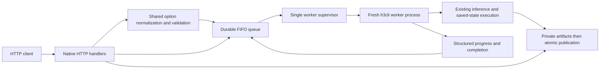

# Native queued server with SGLang video API compatibility

Status: **implemented and qualified; all 34 tasks complete**. Usage is documented in
[the server guide](server.md); measured coverage is in [the results](server-results.md). Written 2026-09-28; request contract
revised 2026-09-29. Implementation tasks are in [the archived server checklist](server-tasks.md).
This work adds `h3cli --server`; it does not
replace the existing command-line workflow or introduce a Python inference
service. Server qualification uses the local M4, with small, short videos.
The user's follow-up authorizes M04 at 56 frames and requires the existing
204-output recorded SGLang parity regression on the PRO 5000. This exception
does not add live SGLang inference or a CUDA server render campaign.

## 1. Outcome and boundaries

Start one native HTTP service, submit independent jobs, receive an ID without
waiting for inference, query status/results, and download completed video or
other artifacts. Preserve every supported h3cli operation and option through
a single optional `h3cli` string in the request, including saved-state workflows, stills,
references, LoRA, preview decoding, and platform-specific optimizations.

Job submission uses only SGLang-defined fields plus **one additional field:
`"h3cli": "<command-line flags>"`**. Map SGLang `quality` to the existing
`--quality` preset. Parse `h3cli` with command-line quoting and the shared CLI
option parser; its settings override the corresponding SGLang data/settings.
There is no second structured options, references, LoRA or operation schema.
The same request envelope serves both video and native job endpoints; native
response metadata, artifact endpoints and internal typed worker IPC remain.

The compatible surface is SGLang's asynchronous diffusion video API and the
MiniMax-H3 request subset that h3cli can execute. It is not SGLang's LLM/chat,
distributed scheduler, realtime WebSocket, training, or arbitrary-model API.
Compatibility concerns HTTP requests and lifecycle semantics; it does not
promise identical Metal/CUDA tensors or identical videos to upstream SGLang.
Existing unsupported feature combinations remain explicit errors.

Deliver all native features in this implementation, rather than postponing
checkpointing, reference audio/video, or latent upscaling to another release.
CUDA options must be represented and routed correctly but advertised as
unavailable on the M4. Their CUDA execution remains unqualified by this work.

## 2. Upstream contract and important differences

Pin the interoperability baseline to SGLang commit
[`7ee7bef79decaf78f7669994f74e6f75c7784c14`](https://github.com/sgl-project/sglang/tree/7ee7bef79decaf78f7669994f74e6f75c7784c14).
Do not make the implementation follow a moving `main` implicitly. Capture small
request/response fixtures with provenance; no SGLang installation or live
SGLang inference service is needed for the M4 tests.

The inspected video router accepts JSON and multipart submissions, returns a
video object, exposes list/retrieve/delete operations, and selects downloaded
outputs with `content?variant=N`. Its delete handler removes metadata but does
not implement inference cancellation. h3cli will additionally stop deleted
work through its own worker supervisor. See the pinned
[video router](https://github.com/sgl-project/sglang/blob/7ee7bef79decaf78f7669994f74e6f75c7784c14/python/sglang/multimodal_gen/runtime/entrypoints/openai/video_api.py).

Video objects include `id`, `object`, `model`, `status`, integer `progress`,
timestamps, `size`, string `seconds`, optional `error`, and output metadata.
Keep that wire shape, with h3cli-specific details under `h3`. The generic
protocol permits extra fields, but model-specific validation still applies.
[Protocol](https://github.com/sgl-project/sglang/blob/7ee7bef79decaf78f7669994f74e6f75c7784c14/python/sglang/multimodal_gen/runtime/entrypoints/openai/protocol.py).

Current H3 requests require `task` and use `conditions` and `target`. Explicit
generic `num_frames`/`fps` and CFG/negative-prompt controls are rejected by its
H3 adapter. Therefore accepting a generic diffusion JSON body is insufficient
to claim compatibility with current H3 clients.
[H3 adapter](https://github.com/sgl-project/sglang/blob/7ee7bef79decaf78f7669994f74e6f75c7784c14/python/sglang/multimodal_gen/runtime/pipelines_core/stages/model_specific_stages/minimax_h3/video_adapter.py).

Two translations must be explicit:

- Upstream H3 `num_inference_steps=N` counts sigma points, normally giving
  `N-1` evaluations. Native `--steps=N` counts evaluations. The compatible
  adapter accepts `N >= 2` and lowers to native `steps=N-1`; it records both
  counts. An upstream one-point/no-denoise request has no equivalent native
  generation job and is rejected when effective. `h3cli` flags such as
  `--steps 2` override that translation and keep native evaluation-count meaning.
  [Time helpers](https://github.com/sgl-project/sglang/blob/7ee7bef79decaf78f7669994f74e6f75c7784c14/python/sglang/multimodal_gen/runtime/pipelines_core/stages/model_specific_stages/minimax_h3/time_request.py),
  [native schedules](../../src/sglang/sglang.c).
- The compatible adapter resolves `target.short_edge`, `aspect_ratio`, and
  `duration_seconds` according to the pinned H3 resolver: a nominal short
  edge, proportional reduction to a 768×1344 area budget, independent nearest
  32-pixel rounding with ties to even, and 24-fps timing rounded to a `17n+5`
  frame boundary. `auto` uses the task's defaults or FL2VA image geometry.
  Native geometry flags override the corresponding resolved values and retain
  existing h3cli validation. Validate the final effective canvas against native
  limits; do not resize it again to satisfy an overridden upstream target.
  [Resolved plan](https://github.com/sgl-project/sglang/blob/7ee7bef79decaf78f7669994f74e6f75c7784c14/python/sglang/multimodal_gen/runtime/pipelines_core/stages/model_specific_stages/minimax_h3/resolved_plan.py).

The upstream target duration range is 4–15 seconds. Shorter native h3cli jobs
remain available through, for example, `"h3cli": "--frames 22"`.
Upstream `quality=high` selects Cache-DiT. The requested server mapping instead
uses h3cli's existing `--quality high`: native conservative adaptive caching on
CUDA and scheduled reuse on Metal. This is an intentional preset mapping, not
Cache-DiT implementation or numerical equivalence. See the
[native quality presets](../usage.md#4-choose-a-speedquality-preset).
The standard-field quality enum is defined in the pinned
[sampling parameters](https://github.com/sgl-project/sglang/blob/7ee7bef79decaf78f7669994f74e6f75c7784c14/python/sglang/multimodal_gen/configs/sample/sampling_params.py);
timing limits come from the pinned
[H3 constants](https://github.com/sgl-project/sglang/blob/7ee7bef79decaf78f7669994f74e6f75c7784c14/python/sglang/multimodal_gen/runtime/pipelines_core/stages/model_specific_stages/minimax_h3/constants.py).

### Compatibility decisions

| Input | Server contract |
| --- | --- |
| `model` | Optional configured served name; default `h3cli`; also register `MiniMaxAI/MiniMax-H3`. A permitted `-d`/`--model-dir` overrides model selection. Resolve only configured resources; never download request-named models. |
| `prompt` | Exact string; no rewriting or prompt enhancement. `-p`/`--prompt` replaces it. The final fresh-generation request needs a prompt. |
| `task` | SGLang-only requests require `t2va`, `fl2va`, or `ref2va`. A nonempty `h3cli` may omit it and infer the existing CLI mode. Effective native mode/input flags may replace a supplied task. |
| `conditions` | Preserve order. Keyframes `0`/`-1` map to first/last anchors; images/videos/audio map to native references. `video_audio` requires embedded audio. Native separate soundtracks and silent video use `--ref-video-audio VIDEO AUDIO` and `--ref-silent-video`; replacement rules are below. |
| `target` | Apply pinned geometry/time resolution for values still needed after native overrides. `--width`, `--height`, `--frames`/`--seconds` take precedence. Audio-derived duration still requires a supported final reference combination. |
| `seconds`, `size`, `width`, `height` with `target` | Without overrides, matching metadata assertions are accepted and contradictions rejected. An overridden geometry/time component is no longer an assertion against the effective native value. |
| `num_frames`, `fps` | Explicit fields remain unsupported in the strict H3 subset. Use `h3cli` flags for native frame counts/duration; delivery remains 24 fps. |
| `seed` | Integer or list matching variant count. `--seed` replaces the scalar or entire list before materializing variants. For scalar `s`, variant `i` uses `s+i`; reject effective bounds/overflow. This deterministic fan-out rule is a documented h3cli extension. |
| `n`, `num_outputs_per_prompt` | Support 1–10 sequential variants; reject inconsistent aliases. One parent job, ordered variants, no GPU batching. |
| `num_inference_steps` | Sigma-point translation above; `--steps` overrides it. Native `--quality` also overrides lower-priority preset-controlled settings as specified below. |
| `flow_shift`, `audio_flow_shift` | Accept omission or the native fixed values 12 and 3. Other values get a named unsupported-option error. |
| `quality` | Accept the pinned SGLang values `lossless`, `extra-high`, `high`; map directly to h3cli `--quality` of the same name. `--quality` in `h3cli` replaces it and also permits native `preview`/`fast-preview`. Presets are defaults, not restrictions on later explicit native controls. Omission does not synthesize `--quality`; document the native 20-step default. |
| `start_time_seconds` | Support zero/omitted. Reject nonzero offsets until the CLI has equivalent reference seeking; do not silently trim/re-encode uploads. |
| Generic `input_reference` upload / `reference_url` | Infer one FL2VA first frame when canonical conditions are absent; otherwise reject unresolved ambiguity. Native input overrides replace the affected inputs before import or media inspection. H3 reference video/audio use canonical conditions or ordered flags. |
| Other SGLang controls | Audit against the pinned source. Reject unsupported non-default behavior, including Cache-DiT/TeaCache, prompt enhancement, arbitrary CFG, interpolation, generic pixel upscaling, RNG-device overrides and unknown fields. Inactive boolean defaults may be accepted only when explicitly listed in the schema. |
| `h3cli` (only added request field) | Optional string of existing CLI flags and values; omitted/empty means no overrides. Apply after SGLang lowering with the precedence below. Reject arrays, objects, null, unknown flags and process-control options. |

Native latent upscaling is accessed as its own saved-state operation. It is not
an implementation of SGLang's generic `enable_upscaling` field. Limitations,
including h3cli reference counts and supported combinations, appear in discovery
and in the compatibility report; do not label the entire SGLang API supported.

## 3. Startup, dependencies and process architecture

Invocation:

```sh
./bin/h3cli --server -d models/MiniMax-H3 \
  --server-host 127.0.0.1 --server-port 30000 \
  --server-state-dir outputs/server
```

Startup settings and defaults:

| Setting | Default / purpose |
| --- | --- |
| `--server` | Select service mode; no prompt or generation side effects at startup. |
| `--server-host`, `--server-port` | `127.0.0.1`, `30000`; fail on a busy port. |
| `--server-state-dir` | `outputs/server`, resolved against startup cwd; DB, immutable inputs, private work directories, published artifacts. Require a local filesystem. |
| `--server-model-id` | `h3cli`; configured aliases resolve to the startup model root. |
| `--server-queue-limit` | 32 waiting variants, plus one active worker; reserve a whole fan-out request atomically. |
| `--server-job-timeout` | 3600 seconds per running variant, configurable; waiting time is measured separately. |
| `--server-max-upload-mib` | 2048 per asset, streamed to disk; also enforce aggregate quotas. |
| `--server-max-storage-mib` | 65536 for managed assets/work/results; bound log/event growth as well. |
| `--server-api-key-file` | Optional on loopback; required for non-loopback binding. Never expose its contents in jobs/logs. |
| `--server-read-root` | Repeatable explicit allowed roots for importing server-local files; no arbitrary local reads by default. |
| `--server-allow-url-inputs` | Off by default; enable bounded HTTP(S) imports under an explicit network policy. |

No automatic startup render or warmup. Ordinary job-specific generation flags
are rejected alongside `--server`; use the request body. `-d` defines the configured server model. Device selection remains a per-job
native flag, subject to the build/backend guards. Model/component/LoRA/cache paths
can be selected per job within configured roots or registered assets. The
server never edits the shared process environment in response to a job.

Use a native HTTP adapter backed by pinned, vendored CivetWeb with its required
license notices, and SQLite for durable queue metadata. Disable directory
listing, CGI, script execution and unneeded protocol features. Bind handlers
explicitly; do not expose the state directory as a web root. CivetWeb supports
embedding in C/C++ and Unix/macOS; inspect and pin the exact version during
implementation. [Embedding documentation](https://github.com/civetweb/civetweb/blob/master/docs/Embedding.md),
[license](https://github.com/civetweb/civetweb/blob/master/LICENSE.md).

Use system SQLite on macOS and add the development library to Linux setup.
WAL metadata stays on local disk, with foreign keys, bounded busy timeouts,
transactions, and `synchronous=FULL`. Large media stays in files, not DB blobs.
[SQLite WAL constraints](https://www.sqlite.org/wal.html).
Adapt the existing bounded [JSON parser](../../src/weights/lora_json.c) behind a
server-neutral interface, retaining strict duplicate-key handling and exact
integer-token parsing; do not round 64-bit seeds through `double`.



The parent handles HTTP, storage and scheduling; it never initializes a GPU.
Spawn a fresh copy of the current executable per variant with `posix_spawn`
and a private process group. Do not fork an initialized Metal/CUDA runtime.
The child receives a versioned normalized request over a private descriptor;
it invokes the same operation dispatcher as the CLI. The parent tokenizes and
validates `h3cli`; it never runs the string in a shell, accepts an executable
name, or forwards unchecked arguments to a subprocess. Models are reloaded for each job:
this knowingly retains CLI cold-start cost in exchange for predictable
memory lifetime and option isolation. Persistent warm workers are future
performance work, not a prerequisite or an implied performance promise.

Exactly one inference worker runs at a time, including decode, LoRA folding,
upscale and still jobs. HTTP upload/status/download remains responsive. Pin
the worker executable identity for the service lifetime; refuse to spawn a
different build mid-session. A server restart is required after rebuilding.

## 4. One option contract for CLI and server

Extract a typed option registry and an owned request structure from
[h3cli.c](../../src/h3cli.c). Keep CLI parsing, SGLang lowering, `h3cli` parsing,
defaults, explicit-set bits, preflight and operation execution connected to that same
registry. HTTP must not maintain an independent incomplete `h3_params` mapper.
CLI exit helpers become recoverable errors for request validation; no malformed
HTTP input may call `exit()` in the parent. No engine arithmetic changes.

Each descriptor records long/short name, type, bounds/enums, default,
explicitness, repeatability/order, input/output path role, operation applicability,
backend/build requirements, and whether the flag is present in the current CLI.
An automated coverage check enumerates every CLI option and fails if it lacks an API
mapping or a named process/presentation equivalent. Omitted values remain
omitted, particularly for sampler resume; do not expand defaults into explicit
overrides before checkpoint semantics are applied.

### Single string syntax and override precedence

After JSON decoding, tokenize `h3cli` like a POSIX command-line argument string:
whitespace separates tokens, single/double quotes group values, and backslashes
escape according to those quoting rules. Preserve empty quoted values, Unicode,
and reference/LoRA order. Then use the actual CLI parser, including short
aliases, `--name=value`, two-argument `--ref-video-audio`, repeated options and
negations such as `--no-preview-vae`. Scalar repetitions follow CLI behavior;
the last `--quality` selects the preset, and explicit controls in this string
beat that preset regardless of their order.

This is an argument lexer, not a shell: no executable prefix, environment
assignments, variable/tilde/glob expansion, command substitution, pipelines or
redirections. Shell-looking text inside a value stays literal. Reject malformed
quotes/escapes, NUL, excess bytes/tokens, stray operands and unknown flags with
the offending token/offset. Startup flags (`--server`, `--server-*`), internal
worker controls and environment changes are not job flags. Existing file/root,
resource and backend policies apply to every effective path/option.

Normalize in these stages, retaining source/provenance and explicit-set bits:

1. Decode/flatten the supported SGLang transport wrappers once. Check field
   names, JSON types, duplicate keys and bounded structure, including overridden
   fields. Extract the one `h3cli` string; do not stringify non-string values.
2. Parse native flags and determine which SGLang values/dependencies they
   replace. Lower only the SGLang components still needed for the effective
   request. Do not open, fetch, probe or lease a replaced image/video/audio,
   model or saved state, or derive geometry/duration from replaced material.
3. Merge by priority, lowest to highest: ordinary native defaults; SGLang
   `quality` preset; explicit mapped SGLang settings; native `--quality` preset;
   explicit individual flags from `h3cli`. Expand presets once with the shared
   CLI implementation. A native preset contributes only the fields it actually
   controls (steps, reuse, adaptive cache and preview VAE), not unrelated values.
4. Resolve remaining dependent geometry/timing from the effective inputs, then
   apply native defaults/checkpoint inheritance where still omitted. Infer the
   final operation, validate its actual combinations/bounds/backend and endpoint
   eligibility, resolve remaining assets, and freeze the admitted request.

The preset layer is intentional: `"quality":"lossless"` plus
`"h3cli":"--quality fast-preview"` uses the native fast-preview recipe, even
if the SGLang part specifies a denoise count. Adding `--steps 2` uses two
evaluations. Within either layer, individual controls beat preset defaults.
A request without native `--quality` retains explicit SGLang steps unless a
native `--steps` replaces them. This preserves normal CLI preset behavior
within the flag string while giving that whole string higher source priority.

| Override family | Required behavior |
| --- | --- |
| Prompt/model/seed | Replace the corresponding SGLang value, including a seed list; then apply model/path policy and variant seed expansion. Unmentioned values retain their SGLang mapping. |
| Geometry/time | Explicit width/height replace each respective dimension; the other dimension may retain its resolved value. `--frames` or `--seconds` replaces SGLang timing as a unit. Multiple native timing flags retain CLI semantics. Recompute dependent render/output geometry and metadata; never force the result back to `target`. |
| First/last anchors | Replace the specified anchor slot; preserve the other slot if compatible. If native anchors change a Ref2VA request into FL2VA, discard the lower-priority Ref2VA inputs and infer the final task. |
| Ordered reference media | Any native `--ref-image`, `--ref-video`, `--ref-silent-video`, `--ref-video-audio` or `--ref-audio` replaces the entire SGLang reference list, in native token order, and clears incompatible lower-priority keyframes. Never append silently. `--ref-image-size` alone changes sizing and keeps the references. |
| LoRA | Repeated `--lora` values retain CLI order and scale syntax; no separate JSON LoRA array. |
| Native operation | Resume, decode, upscale, inspection, still and continuation flags drive existing CLI dispatch. A changed operation supersedes lower-priority `task` and discards SGLang generation-only inputs/settings inapplicable to that operation; keep compatible mapped settings. Conflicting native flags still fail native preflight. |

Do not reject a valid effective request just because its native settings differ
from SGLang fields. For example, overridden SGLang model IDs/media need not
exist, and an overridden target size need not fit native limits. Malformed JSON,
unknown keys, invalid field types and unsupported controls with no mapping
(such as arbitrary CFG or a requested Cache-DiT implementation) remain errors;
the string is not a general bypass for unsupported features. Validate semantic
conflicts only on effective values. Responses identify effective operation,
quality, geometry, seeds, recipe and overridden fields rather than echoing
superseded metadata. No second client request mode selector is needed.

`GET /v1/h3/capabilities` publishes this versioned contract, platform/build
support, model aliases, shared compatibility restrictions, current limits,
and separate `available` versus `validated_here` fields. CUDA-only features
on M4 return `unsupported_backend`; they must not silently fall back to Metal.

### Complete current feature mapping

The CLI option inventory must be regenerated from the current source when the
server is implemented. Removed execution selectors and old-file delivery modes
are not server options.
Short aliases resolve to the same descriptor. The table inventories flags
available inside `h3cli`, not extra JSON keys. Keep their CLI names and meanings.

| Feature group | CLI options / equivalent server behavior |
| --- | --- |
| Common request | `prompt`, `model-dir`, `output`, `seed`, `quality`, `width`, `height`, `render-width`, `render-height`, `frames`, `seconds`, `steps`; output is a managed artifact name, not an arbitrary filesystem destination. |
| Keyframes / references | `first-frame`, `last-frame`, `ref-image`, `ref-image-size`, `ref-video`, `ref-silent-video`, `ref-video-audio`, `ref-audio`. Preserve mixed reference token order, including external audio paired with video. |
| Continuation | `continue-from`, `continue-context`, `continue-mode`, `continue-bridge-steps`, `continue-bridge-max-strength`, `continue-bridge-profile`, `keep-continuation-prefix`. |
| Conditioning | `save-conditioning`, `load-conditioning`, `conditioning-schedule`; saved `.h3cond` becomes a reusable artifact. |
| Checkpoint / AV state | `save-av-state`, `stop-after-step`, `save-sampler-state`, `resume-sampler-state`, `preview-on-stop`, `state-only`; pausing is a successful checkpoint result, distinct from cancellation. |
| Decode | `decode-av-state`, `decode-still-latent`; retain `.presentation` sidecars and provenance as one logical artifact bundle. |
| Still | `still`, `save-still-latent`, `image-vae`; expose PNG and latent artifacts. |
| Latent upscale | `save-upscale-state`, `upscale-state`, `upscale-model`, `upscale-refine-steps`, `upscale-noise`, `upscale-seed`, `upscale-import-sampler`, `inspect-upscale-state`. |
| Preview / delivery | `preview-vae`, `no-preview-vae`, `preview-vae-model`, `frames-dir`; preview/full decode retains CLI behavior, frame directories become indexed downloadable artifacts. |
| LoRA | Ordered repeatable `lora` entries with explicit scale, `lora-cache`, `lora-memory-mib`; preserve native folding, CoW behavior, and cache leases. |
| General approximation / placement | `reuse`, `layers`, `core-reuse`, `token-reduction`, `ssd-streaming`, `use-int8-row-fc2`, `use-reference-rope`. |
| Metal | `backend`, `metal-attention`, `metal-attention-kernel`, `metal-attention-dtype`, `metal-tier`, `metal-attention-layout`, `metal-ane`, `metal-ane-rows`, `metal-ane-chunk`, `metal-weight-format`, `metal-q8-kernel`. Preserve opt-in requirements. |
| SOL | `sol-q-block`, `sol-kv-block`, `sol-tau`, `sol-dense-layers`, `sol-dense-steps`, `sol-dense-sigma`, `sol-local-radius`, `sol-min-exact`; keep backend-specific interpretation. |
| CUDA | `cuda-device`, `cuda-weight-mode`, `cuda-attention`, `cuda-denoise-quant`, `cuda-denoise-quant-cache`, `cuda-denoise-quant-verify`. |
| Adaptive / SubBlock | `adaptive-cache`, `adaptive-cache-threshold`, `adaptive-cache-max-hits`, `adaptive-cache-max-mib`, `adaptive-cache-warmup`, `subblock-warmup`, `subblock-sparsity`; preserve effective controls and explicit zero, BF16 image/video/audio and mixed references, reference score recipe 3 and hard/bridge continuation recipe 4, quantization exclusions and exact checkpoint overrides. New segments reset adaptive history; same-job resume restores it without original media. |
| Diagnostic arithmetic | `use-slower-bf16-mlp`, `use-slower-bf16-qkv`, `use-slower-bf16-attention-output`, `use-slower-row-major-attention-output`, `use-slower-unfused-int8-inputs`, `use-slower-unfused-qkv-rope`, `use-slower-scalar-qkv-rms`, `use-slower-uncached-int8-scales`, `use-slower-dynamic-fc1-k`, `use-slower-grouped-quantizer`. |
| Inspection / presentation | `profile` produces timing/log artifacts; `info` becomes an inspection job and cached discovery result; `help` becomes schema/documentation. `show` enables callback-driven preview artifacts/events; `zoom` is preserved as client display metadata, not terminal escape sequences written to the daemon console. |
| Removed names | Removed CLI names are unknown options and have no server aliases. Use only current state formats and preserve AV/presentation pairs. |

All input path descriptors accept managed
asset IDs, completed artifact IDs, or permitted imported paths. Output path
descriptors accept safe relative artifact names. Registry-backed tests cover
every listed option, including output-only and informational modes.

For example, this native job preserves image, paired video/audio and LoRA order
using the same flag spelling/arity as the CLI (IDs are illustrative):

```json
{
  "prompt": "A musician plays in a quiet room.",
  "h3cli": "--ref-image asset://portrait --ref-video-audio asset://motion asset://soundtrack --lora asset://adapter:0.7 --width 256 --height 256 --frames 22 --steps 2"
}
```

No `h3`, `options`, `references`, `loras` or `operation` request objects are
accepted. SGLang's own `conditions` remains available. Default
outputs are `video.mp4` or `image.png` within each variant, while explicit
native output names remain relative to that variant. Cache-directory options
select server-owned cache namespaces or administrator-configured writable
roots, never arbitrary remote-client write locations.

## 5. HTTP endpoints and request forms

| Endpoint | Behavior |
| --- | --- |
| `GET /health`, `/liveness` | Lightweight service status; readiness fails during shutdown or storage failure, not merely because inference is busy. |
| `GET /v1/models` | Configured served model IDs and supported media tasks. |
| `GET /v1/h3/capabilities` | SGLang field schema, `h3cli` syntax/flag inventory and precedence, backend support and pinned compatibility profile. |
| `POST /v1/videos` | SGLang-compatible submit; HTTP 200 with queued video object after durable admission. JSON and multipart supported. |
| `GET /v1/videos` | Video jobs; `after`, `limit` 1–100, `order=asc|desc`, stable creation-order pagination; response `{object:"list",data:[...]}`. |
| `GET /v1/videos/{id}` | Poll the video object, including error/progress and native result details. |
| `GET /v1/videos/{id}/content?variant=0` | Completed MP4 download; default first variant. HTTP 404 before publication, matching upstream readiness behavior. |
| `DELETE /v1/videos/{id}` | Return the video object with `status:"deleted"`; hide it, cancel outstanding work, and schedule safe artifact cleanup. Subsequent retrieval is 404. |
| `POST /v1/h3/jobs` | HTTP 202 for any native operation, including still, state-only, decode, resume, upscale and inspection; same SGLang-plus-`h3cli` envelope, no operation field. |
| `GET /v1/h3/jobs`, `/v1/h3/jobs/{id}` | Native queue/status/results with exact geometry, operation outcome, timings and artifacts. |
| `POST /v1/h3/jobs/{id}/cancel` | Idempotent cancellation; distinguish acceptance of cancellation from worker exit. |
| `GET /v1/h3/jobs/{id}/events` | Bounded SSE progress and artifact events; reconnect using `Last-Event-ID`. Polling remains sufficient to complete a job. |
| `POST /v1/h3/assets` | Stream one multipart file to a managed asset; return ID, type, size and digest. |
| `GET/DELETE /v1/h3/assets/{id}` | Metadata / removal; reject removal while leased by queued/running jobs. |
| `GET /v1/h3/jobs/{id}/artifacts/{artifact_id}` | Download published PNG, MP4, latent, state, bundle, frame or log. Support HEAD and single byte ranges for large files. |

Use SGLang-style `detail` errors for compatible endpoints, with stable native
codes under `h3.error`. Native errors include `code`, `message`, `field` and
`retryable`. Malformed requests/unsupported fields are 400, absent resources
404, conflicting idempotency keys/invalid state transitions 409, oversized
uploads 413, full queue 429 with `Retry-After`, and unavailable service 503.
Inference errors after admission are recorded in the job; a polling request
itself still returns 200. No job is created for synchronous validation failure.

For the compatible route, accept top-level SGLang fields, SDK-merged
`extra_body`, nested `extra_body`/`extra_json`, and `extra_params`; multipart
JSON fields must be parsed strictly. Flatten exactly once, allow duplicate
aliases only when equal, and reject transport-level conflicts/unknown keys.
`h3cli` is the only added request field, including after wrapper flattening;
multiple conflicting copies of that string are an error. Its options override
SGLang values regardless of JSON key order or wrapper placement. SDK clients
can pass `extra_body={"h3cli": "--steps 2"}`. Multipart accepts one text field
`h3cli` containing the same decoded string; do not JSON-decode the flag string
a second time. Both job routes use this same normalization.

Example override submission to `POST /v1/videos`. The final job is
256×256, 22 frames, two native evaluations, seed 42, full VAE and reuse 1;
the effective quality label is `preview`. Explicit flags within the string
override that preset even though it follows `--steps`. The target and upstream
step count do not constrain the resulting native job:

```json
{
  "model": "h3cli",
  "prompt": "A small paper boat moves slowly across calm water.",
  "task": "t2va",
  "conditions": [],
  "target": {"short_edge": 640, "aspect_ratio": "4:3", "duration_seconds": 4},
  "num_inference_steps": 51,
  "quality": "lossless",
  "seed": 7,
  "h3cli": "--width 256 --height 256 --frames 22 --steps 2 --quality preview --reuse 1 --no-preview-vae --seed 42 --save-av-state clean.h3av"
}
```

Example canonical H3 body (three sigma points mean two native evaluations):

```json
{
  "model": "MiniMaxAI/MiniMax-H3",
  "prompt": "A small paper boat moves slowly across calm water.",
  "task": "t2va",
  "conditions": [],
  "target": {"short_edge": 256, "aspect_ratio": "1:1", "duration_seconds": 4},
  "num_inference_steps": 3,
  "quality": "extra-high",
  "seed": 42
}
```

SGLang-only requests keep the pinned `task` requirement. A request with
nonempty `h3cli` can omit `task`/`target` and infer the operation and ordinary
defaults exactly as a CLI invocation. All five native quality names remain
available through `--quality`; the standard field accepts only SGLang's three.

`/v1/h3/jobs` derives generate/still/resume/decode/upscale/inspection operations
from existing flags; clients never provide a second operation selector. For
example, submit a decode job using only the extra string:

```json
{
  "h3cli": "--decode-av-state artifact://JOB/AV_STATE -o decoded.mp4"
}
```

Other examples are `--resume-sampler-state artifact://JOB/SAMPLER`,
`--upscale-state artifact://JOB/UPSCALE --upscale-refine-steps 2`, or
`--still --width 256 --height 256 --steps 2` with a SGLang `prompt`.
The normal native checks determine which other flags each operation needs.
`/v1/videos` accepts operations that produce a completed MP4;
checkpoint-only/paused/still/inspection jobs use the native route, so ordinary
SGLang polling clients never receive a completed video with no downloadable
video. Reuse completed artifacts through `artifact://JOB/ARTIFACT`, preserving
all saved-state checks and associated sidecars.

Return relative download URLs by default. Do not publish absolute server paths
in `file_path`/`file_paths`; keep those nullable compatibility fields and expose
artifact IDs/URLs under response-only `h3`. This response namespace is not an
accepted request option. Report actual delivered size, frame count,
24-fps duration, video/audio properties and native build/recipe provenance,
including continuation prefix trimming and upscaled dimensions.

## 6. Queue, durability, cancellation and output publication

Use SQLite tables for jobs, ordered variants, assets, artifact bundles, leases,
events and idempotency records. One scheduler transaction claims the oldest
eligible variant; preserve FIFO across parent requests and within a fan-out.
The queue limit counts variants so one `n=10` request cannot bypass admission.
Freeze effective normalized options, explicit-set mask, override provenance,
seeds, input identities and schema/build versions when admitting the job.
`Idempotency-Key` replays the
same response for the same canonical request; a different request is 409.

Internal states: `queued -> running -> completed|failed|cancelled|interrupted`.
`cancelling` may precede `cancelled`. A successfully written checkpoint is
`completed` with `result.kind=paused`, not a failed generation. Compatible
video projection uses `queued`, `in_progress`, `completed`, or `failed`;
cancelled/interrupted map to `failed` with a specific error code. Deletion is
a visibility/tombstone property, not proof that a process has already exited.

A job is accepted only after input assets and its DB transaction are durable.
On restart, preserve queued order and immutable inputs; never rerun a job that
was running automatically. Mark it interrupted unless a durable completion
manifest proves all required artifacts were committed. Users can submit an
explicit resume job from a valid checkpoint. Do not infer checkpoint validity
from a `.part` filename or attempt transparent cross-build resume.

Each worker writes only inside its private work directory. Required files,
including AV presentation sidecars, are closed and validated before an atomic
manifest/directory publication. Mark success after publication; consumers never
download partial MP4s or half a checkpoint bundle. If any requested variant
fails, the parent is failed; native results identify individually completed
variants without pretending all variants succeeded. Preserve earlier complete
variant downloads. Completed jobs are retained until explicit deletion or an
explicitly configured retention policy; quota exhaustion rejects new work.

Cancellation removes queued work atomically. For active work, signal a private
control channel; existing progress/frame callbacks request cooperative engine
cancellation. After a bounded grace period terminate the worker process group,
including FFmpeg, then reap it before starting the next GPU job. A worker's
control-pipe EOF also cancels, so a dead parent cannot leave inference running.
On service shutdown stop admission, preserve queued jobs, cancel/reap active
work and drain publication transactions. Handle completion-versus-cancel/delete
races under one state transition transaction.

Do not scrape terminal progress strings. Add structured worker events using the
existing `on_progress`/`on_frame` callbacks and an explicit completion record.
Expose phase, counters, current variant, queue wait, running time and errors.
Top-level percent is a documented phase estimate, capped below 100 until all
required artifacts publish. A phase counter does not certify GPU completion.
Bound preview frequency, event retention, log size and slow-client buffering;
an SSE disconnect must not cancel inference or block the GPU worker.

## 7. Files, resource limits and transport safety

All managed assets use generated IDs. Ignore upload filenames as paths; verify
media/container type and size, then finalize by atomic rename. Inputs referenced
by a queued request are immutable snapshots with leases until execution ends.
Resolve relative administrator paths once against startup cwd; never call
process-wide `chdir()` from HTTP handlers. Workers retain the configured source
root for shader discovery, with absolute validated model/input/output paths.

For allowed local imports, require canonical containment and safe descriptor
opens; reject traversal, symlink escape and non-regular files. Snapshot media
before acknowledgement so later external edits cannot change queued work.
Large configured model/LoRA roots may use read-only identity/lease policies
rather than copying base weights; preserve existing metadata-based model
identity and optional explicit strict verification. Do not hash every model
weight during ordinary admission.

Admission is staged: reserve capacity, validate/snapshot bounded inputs and
normalize the request, then commit the queued row and leases together. Release
reservations and temporary uploads on every error/disconnect. Static option
and geometry errors are synchronous; model-dependent execution/admission
errors may fail the queued job with the existing native diagnostic. Status
handlers never wait behind GPU execution or hold a DB transaction while
streaming an upload/download.

Optional URL imports accept HTTP(S) only, with finite redirects, timeouts and
byte caps. Apply address policy to every redirect and connection to prevent
SSRF/DNS rebinding; reject loopback/private/metadata destinations unless an
administrator explicitly permits that source. Default clients can upload
files instead. Reject arbitrary `output_path`, shell execution of `h3cli`,
process environment overrides and unregistered internal worker modes.

Set finite HTTP header/body, JSON depth/array/string, open connection, upload,
disk, subprocess, model geometry and execution-time limits. Stream file I/O
and downloads instead of buffering complete MP4s/states. Preserve CLI/model
memory admission; large requests either fit or fail explicitly. API discovery
exposes resource limits. Store state with restrictive permissions; a second
server cannot acquire the same queue directory. Authenticate all job/asset/
artifact operations when configured; no permissive default CORS. TLS, if needed,
terminates at an explicitly configured reverse proxy in this first release.

## 8. Implementation layout

Keep project source under `src/`, dependencies under `third_party/`, executables
and the archive under ignored `bin/`, and validation artifacts under ignored
`outputs/server-validation/`. Proposed modules (names may be combined when small):

- `src/cli/options.c/.h`, `src/cli/arguments.c/.h`: registry, CLI-compatible
  argument lexer/parsing and explicit option provenance.
- `src/request.c/.h`: owned common request, shared preflight and operation
  dispatch extracted without changing CLI behavior.
- `src/server/server.c/.h`, `src/server/http.c`, `src/server/sglang.c`:
  lifecycle, route handlers, SGLang lowering, override merge and discovery.
- `src/server/queue.c`, `src/server/assets.c`: SQLite transactions, leases, file
  publication, path policies, quotas and recovery.
- `src/server/worker.c`: spawn/control/progress protocol, timeouts, process-group
  cleanup and existing execution callbacks.

Build the service into `bin/h3cli`; `bin/libh3.a` remains usable without running
HTTP infrastructure. Pin the HTTP dependency and include hashes/licenses;
update setup scripts for build dependencies without adding Python, PyTorch,
SGLang, an external database daemon or a separately installed web service to
inference requirements. Version the HTTP extension, DB schema and worker IPC
independently from existing saved-state formats.

## 9. Local M4 validation and acceptance

The original scope limited qualification to local M4. The user subsequently
approved M04 at 56 frames and requested the complete recorded SGLang parity
regression required by [CONTRIBUTING.md](../../CONTRIBUTING.md). Run that gate
on the authorized PRO 5000, keeping all 204 goldens and input fixtures unchanged.
Server render/lifecycle qualification remains on M4; record the CUDA CLI
regression separately and do not claim CUDA server or live-oracle qualification.

Use CPU-only contract tests and a fake worker for exhaustive queue/HTTP/failure
cases. Fake-worker artifacts must be labeled; they do not count as actual H3
renders. Build the Metal binary and run applicable CLI/host tests. Check CLI
option coverage mechanically, SGLang-plus-`h3cli` normalization including explicit
zeros/false/omissions, ordered references/LoRA, saved-state dispatch, and all
backend/combination rejections. Test both existing one-shot CLI and server mode.

Contract fixtures must prove the single-extra-field allowlist; all standard
quality mappings and native preview presets; quoting/escaping/short aliases;
last-value and preset order behavior; and each override family in section 4.
Include conflicting prompt, seed list, target/metadata, step count, first/last
anchors, ordered image/video/audio references, model and operation inputs.
An overridden missing file or URL must never be touched. Check geometry derived
from replacement anchors and every omitted-versus-explicit checkpoint case.
Repeat key cases as JSON, multipart and SDK extras in different key orders.
Reject the removed structured request shape, malformed strings and startup
flags. Shell-like values stay inert. Compare effective requests to equivalent
ordinary CLI argv and verify truthful response metadata after overrides.

Actual model tests use the default supported Metal path unless the row names
an optional path. Freeze one prompt and seed 42; record exact commands,
requests, runtime/model metadata, artifacts, timings and outcomes. Normally use
**256×256, 22 frames, two evaluations**. All GPU invocations are capped at six
evaluations; use `H3_TEST_MAX_EVALUATIONS=6` only in the test environment, never
as a production server default. Do not increase shapes to rescue a failure
outside the explicitly approved M04 exception below.

| Case | Local M4 workload / evidence |
| --- | --- |
| M01 Queue + T2VA | Submit two 256×256/22-frame/two-step jobs while the first runs. One uses the conflicting SGLang-plus-`h3cli` example; the other infers CLI mode without `task`. Prove one worker, effective preset/overrides and playable AV MP4s; save clean AV/conditioning/upscale artifacts from the applicable job. |
| M02 Canonical SGLang H3 | One SGLang-only `quality=extra-high`, `target.short_edge=256`, 1:1, four-second target with `num_inference_steps=3`: resolves to 107 frames and two evaluations. Poll/download through an upstream-shaped client. This is the only required longer clip, approximately 4.46 seconds. |
| M03 FL2VA + uploads | 256×256/22/two steps with first+last images; replace one SGLang anchor through a native flag. Multipart/JSON lowering get separate CPU coverage. Verify effective asset identity, endpoint-frame order and matching center-crop behavior. |
| M04 Ref2VA | 256×256/56/two steps (user-approved exception for Metal's 48-frame reference-video minimum) with an ordered image, tiny video and short audio reference supplied through flags replacing a SGLang reference list. Verify no stale/duplicate inputs; embedded/external/silent audio mappings get host tests. Use `--ref-image-size match`; test `high`/`max` sizing/admission without large encoders. |
| M05 Conditioning + preview | Reload M01 conditioning at the same recipe/geometry; use preview VAE for delivery, preview callbacks for events, and frame artifacts. Check cache admission, output retrieval and bounded progress. |
| M06 Pause + resume + decode | 256×256/22 with a four-step schedule; stop after two, publish sampler state, then resume the remaining two. State-only/preview-on-stop choices get distinct requests; decode a saved AV artifact in a separate job. |
| M07 Continuation | Create a 256×256/39-frame/two-step source, then a 56-frame/two-step continuation with 39 context frames. Check delivered trimming. Exercise bridge mapping/guards and a bounded bridge job on the same small geometry. |
| M08 Latent upscale | From a qualifying M01 `.h3up`, generate 512×512/22 with two refinement steps; inspect the source and exercise zero-refinement planning/dispatch. Verify audio preservation and all result artifacts. |
| M09 Still | 256×256/two-step PNG plus saved still latent; decode that latent through another native job. No video object is fabricated. |
| M10 LoRA and native controls | A compatible, identified adapter on 256×256/22/two steps; prove scale/order isolation with host fixtures. Use six-step 256×256/22 jobs for SGLang `quality=high` (Metal reuse 2) and native `--quality fast-preview` (reuse 3); bound steps explicitly, override preview VAE if needed. Test remaining mappings on host. |
| M11 Metal options | One bounded 256×256/22/two-step Metal dense or SOL job with explicit opt-in; preserve required math/preview settings. ANE, Q8, layout, and diagnostic options receive native parser/dispatch and existing local host coverage; no new quality qualification is implied. |
| M12 Cancellation / recovery | Cancel a small active job, wait for worker/FFmpeg cleanup, then successfully render another 256×256/22/two-step job. Use fake workers for deterministic restart/publication races, timeouts, full queues and quota failures. |

For every real MP4, check full FFmpeg decode, declared dimensions, actual frame
count/duration, 24 fps and expected audio. For PNG/state/latent artifacts, check
format, ownership and the existing loader/inspection path. Compare same-build
CLI/server normalized requests and one small deterministic CLI/server case;
this is transport-equivalence testing, not upstream SGLang parity. Include
HTTP content type, range/HEAD behavior and stable bytes on repeated downloads.

Use a per-invocation test deadline of 900 seconds and serial GPU execution. A
missing model/adapter, OOM or deadline is a recorded blocker/failure, not a pass
or permission to use another machine. Fixture preparation can create tiny
synthetic reference media and a bounded compatible test adapter locally.
Capture any true platform limitation in capabilities and the final report;
do not mark an operation delivered merely because its fake worker test passed.

Completion requires exactly one added job-request field, complete override and
quality tests, all CLI options accounted for, every operation routed,
the compatibility request/lifecycle suite passing, the required M4 media
matrix complete, no leaked workers/artifact leases, documented client examples,
and a report distinguishing real server renders, host-only checks, the recorded
CUDA CLI regression and untested CUDA server execution.

## Automatic model preparation addendum

The [native model-download design](design-model-downloads.md) and
[operational guide](model-downloads.md#queued-server-jobs) add startup root and
offline controls without new SGLang request fields or endpoints. Admission
persists a dependency plan and identities of required existing files. A
supervised preparation worker keeps the standard job queued, publishes verified
weights and refreshes the resource snapshot before an offline inference worker
starts. Preparation and inference have independent deadlines. Unrelated model
groups do not invalidate snapshots; changed required files do.
